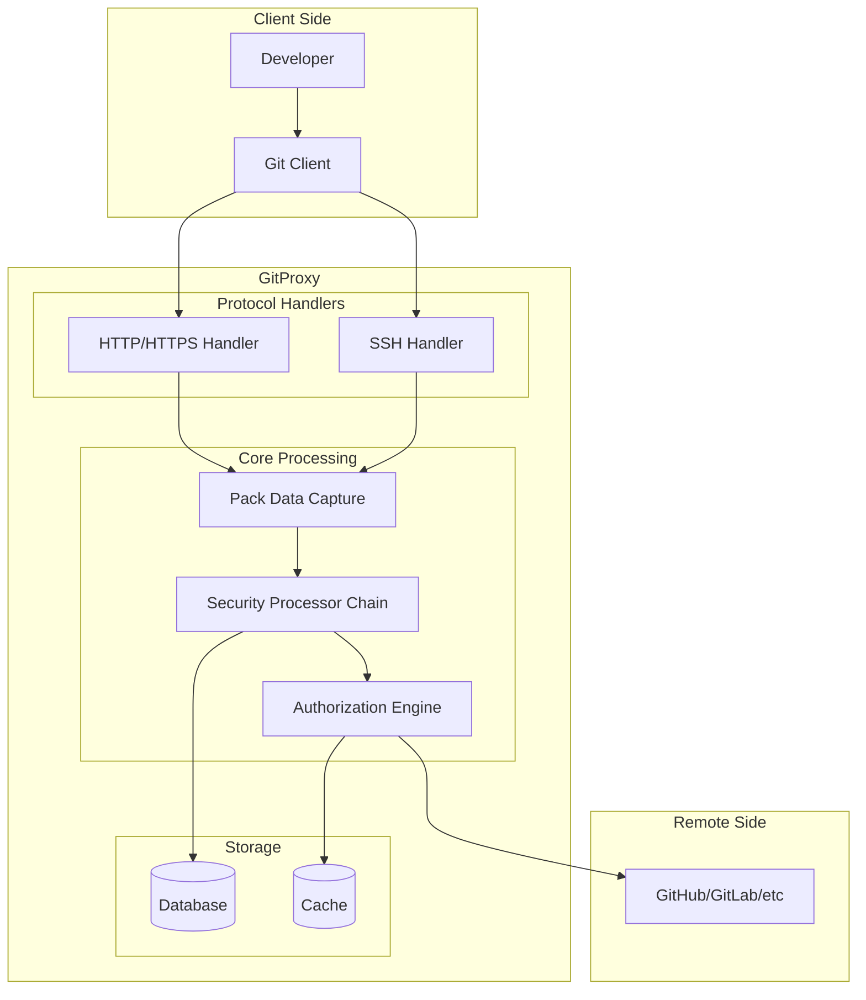
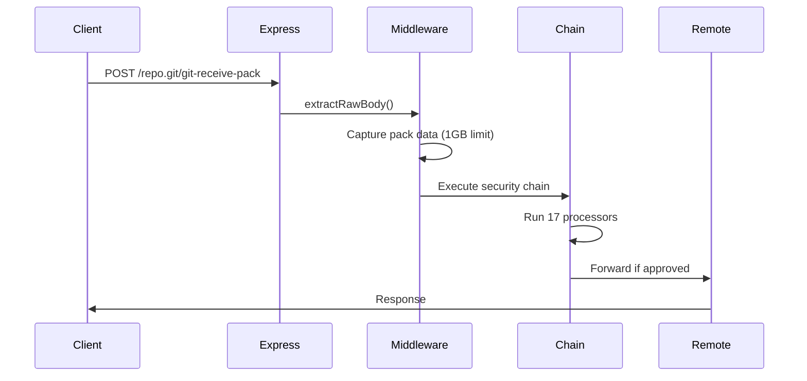
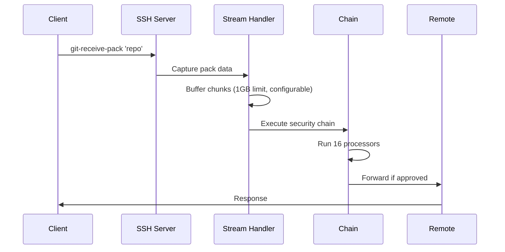

# GitProxy Architecture

**Version**: 2.0.0-rc.3  
**Last Updated**: 2025-01-10

## Overview

GitProxy is a security-focused Git proxy that intercepts push operations between developers and Git remote endpoints (GitHub, GitLab, etc.) to enforce security policies, compliance rules, and workflows. It supports both **HTTP/HTTPS** and **SSH** protocols with identical security scanning through a shared processor chain.

## High-Level Architecture



## Core Components

### 1. Protocol Handlers

#### HTTP/HTTPS Handler (`src/proxy/routes/index.ts`)

- **Purpose**: Handles HTTP/HTTPS Git operations
- **Entry Point**: Express middleware
- **Key Features**:
  - Pack data extraction via `getRawBody` middleware
  - Request validation and routing
  - Error response formatting (Git protocol)
  - Streaming support up to 1GB

#### SSH Handler (`src/proxy/ssh/server.ts`)

- **Purpose**: Handles SSH Git operations
- **Entry Point**: SSH2 server
- **Key Features**:
  - SSH agent forwarding (uses client's SSH keys securely)
  - Stream-based pack data capture
  - SSH user context preservation (keys never stored on proxy)
  - Error response formatting (stderr)

### 2. Security Processor Chain (`src/proxy/chain.ts`)

The heart of GitProxy's security model - a shared 16-processor chain used by both protocols:

```typescript
const pushActionChain = [
  proc.push.parsePush, // Extract commit data from pack
  proc.push.checkEmptyBranch, // Validate branch is not empty
  proc.push.checkRepoInAuthorisedList, // Repository authorization
  proc.push.checkCommitMessages, // Commit message validation
  proc.push.checkAuthorEmails, // Author email validation
  proc.push.checkUserPushPermission, // User push permissions
  proc.push.pullRemote, // Clone remote repository
  proc.push.writePack, // Write pack data locally
  proc.push.checkHiddenCommits, // Hidden commit detection
  proc.push.checkIfWaitingAuth, // Check authorization status
  proc.push.preReceive, // Pre-receive hooks
  proc.push.getDiff, // Generate diff
  proc.push.gitleaks, // Secret scanning
  proc.push.clearBareClone, // Cleanup
  proc.push.scanDiff, // Diff analysis
  proc.push.blockForAuth, // Authorization workflow
];
```

### 3. Database Abstraction (`src/db/index.ts`)

Two implementations for different deployment scenarios:

#### NeDB (Development)

- **File-based**: Local JSON files
- **Use Case**: Development and testing
- **Performance**: Good for small to medium datasets

#### MongoDB (Production)

- **Document-based**: Full-featured database
- **Use Case**: Production deployments
- **Performance**: Scalable for large datasets

### 4. Configuration Management (`src/config/`)

Hierarchical configuration system:

1. **Schema Definition**: `config.schema.json`
2. **Generated Types**: `src/config/generated/config.ts`
3. **User Config**: `proxy.config.json`
4. **Configuration Loader**: `src/config/index.ts`

## Request Flow

### HTTP/HTTPS Flow



### SSH Flow



## Security Model

### Pack Data Processing

Both protocols follow the same pattern:

1. **Capture**: Extract pack data from request/stream
2. **Parse**: Extract commit information and ref updates
3. **Clone**: Create local repository copy
4. **Analyze**: Run security scans and validations
5. **Authorize**: Apply approval workflow
6. **Forward**: Send to remote if approved

### Security Scans

#### Gitleaks Integration

- **Purpose**: Detect secrets, API keys, passwords
- **Implementation**: External gitleaks binary
- **Scope**: Full pack data scanning
- **Performance**: Optimized for large repositories

#### Diff Analysis

- **Purpose**: Analyze code changes for security issues
- **Implementation**: Custom pattern matching
- **Scope**: Only changed files
- **Performance**: Fast incremental analysis

#### Hidden Commit Detection

- **Purpose**: Detect manipulated or hidden commits
- **Implementation**: Pack data integrity checks
- **Scope**: Full commit history validation
- **Performance**: Minimal overhead

### Authorization Workflow

#### Auto-Approval

- **Trigger**: All security checks pass
- **Process**: Automatic approval and forwarding
- **Logging**: Full audit trail maintained

#### Manual Approval

- **Trigger**: Security check failure or policy requirement
- **Process**: Human review via web interface
- **Logging**: Detailed approval/rejection reasons

## Plugin System

### Architecture (`src/plugin.ts`)

Extensible processor system for custom validation:

```typescript
class MyPlugin {
  async exec(req: any, action: Action): Promise<Action> {
    // Custom validation logic
    return action;
  }
}
```

### Plugin Types

- **Push Plugins**: Inserted after `parsePush` (position 1)
- **Pull Plugins**: Inserted at start (position 0)

### Plugin Lifecycle

1. **Loading**: Discovered from configuration
2. **Initialization**: Constructor called with config
3. **Execution**: `exec()` called for each request
4. **Cleanup**: Resources cleaned up on shutdown

## Error Handling

### Protocol-Specific Error Responses

#### HTTP/HTTPS

```typescript
res.set('content-type', 'application/x-git-receive-pack-result');
res.status(200).send(handleMessage(errorMessage));
```

#### SSH

```typescript
stream.stderr.write(`Error: ${errorMessage}\n`);
stream.exit(1);
stream.end();
```

### Error Categories

- **Validation Errors**: Invalid requests or data
- **Authorization Errors**: Access denied or insufficient permissions
- **Security Errors**: Policy violations or security issues
- **System Errors**: Internal errors or resource exhaustion

## Performance Characteristics

### Memory Management

#### HTTP/HTTPS

- **Streaming**: Native Express streaming
- **Memory**: PassThrough streams minimize buffering
- **Size Limit**: 1GB (configurable)

#### SSH

- **Streaming**: Custom buffer management
- **Memory**: In-memory buffering up to 1GB
- **Size Limit**: 1GB (configurable)

### Performance Optimizations

#### Caching

- **Repository Clones**: Temporary local clones
- **Configuration**: Cached configuration values
- **Authentication**: Cached user sessions

#### Concurrency

- **HTTP/HTTPS**: Express handles multiple requests
- **SSH**: One command per SSH session
- **Processing**: Async processor chain execution

## Monitoring and Observability

### Logging

- **Structured Logging**: JSON-formatted logs
- **Log Levels**: Debug, Info, Warn, Error
- **Context**: Request ID, user, repository tracking

### Metrics

- **Request Counts**: Total requests by protocol
- **Processing Time**: Chain execution duration
- **Error Rates**: Failed requests by category
- **Resource Usage**: Memory and CPU utilization

### Audit Trail

- **User Actions**: All user operations logged
- **Security Events**: Policy violations and approvals
- **System Events**: Configuration changes and errors

## Deployment Architecture

### Development

```
Developer → GitProxy (NeDB) → GitHub
```

### Production

```
Developer → Load Balancer → GitProxy (MongoDB) → GitHub
```

### High Availability

```
Developer → Load Balancer → Multiple GitProxy Instances → GitHub
```

## Security Considerations

### Data Protection

- **Encryption**: TLS/HTTPS for all communications
- **Transit**: SSH agent forwarding (keys never leave client)
- **Secrets**: No secrets in logs or configuration

### Access Control

- **Authentication**: Multiple provider support
- **Authorization**: Granular permission system
- **Audit**: Complete operation logging

### Compliance

- **Regulatory**: Financial services compliance
- **Standards**: Industry security standards
- **Reporting**: Detailed compliance reports

## Future Enhancements

### Planned Features

- **Rate Limiting**: Per-user and per-repository limits
- **Streaming to Disk**: For very large pack files
- **Performance Monitoring**: Real-time metrics
- **Advanced Caching**: Repository and diff caching

### Scalability

- **Horizontal Scaling**: Multiple instance support
- **Database Sharding**: Large-scale data distribution
- **CDN Integration**: Global content distribution

---

**Architecture Status**: ✅ **Production Ready**  
**Scalability**: ✅ **Horizontal Scaling Supported**  
**Security**: ✅ **Enterprise Grade**  
**Maintainability**: ✅ **Well Documented**
