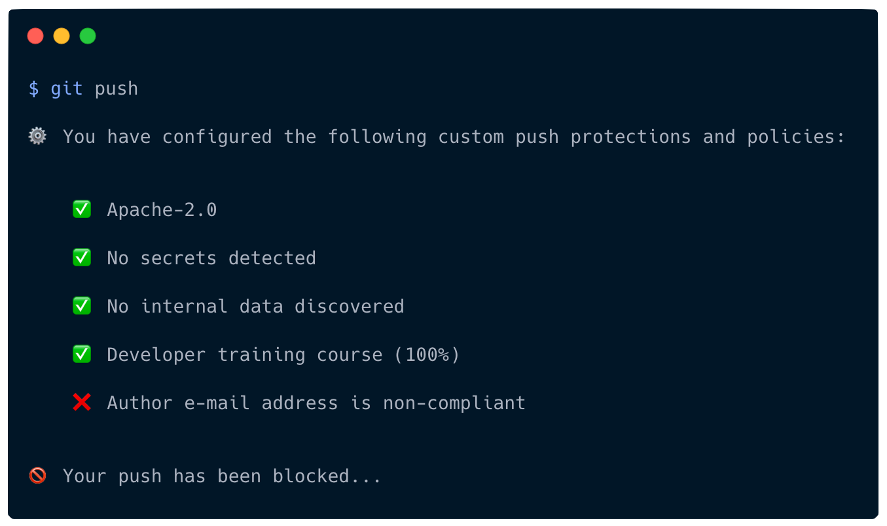

<br />
<div align="center">
  <a href="https://github.com/finos/git-proxy">
    
  </a>

  <br />
  <br />

  <p align="center">
    Deploy custom push protections and policies<br />on top of Git
    <br />
    <br />
    <a href="https://www.npmjs.com/package/@finos/git-proxy"><strong><code>npm install @finos/git-proxy</code></strong></a>
    <br />
    <br />
    <a href="https://github.com/finos/git-proxy/issues/new?assignees=&labels=&projects=&template=bug_report.md&title=">Report a bug</a>
    ·
    <a href="https://github.com/finos/git-proxy/issues/new?assignees=&labels=&projects=&template=feature_request.md&title=">Suggest a new feature</a>
  </p>

  <br />

[](https://finosfoundation.atlassian.net/wiki/display/FINOS/Released)
[](https://www.npmjs.com/package/@finos/git-proxy)
[](https://github.com/finos/git-proxy/actions/workflows/nodejs.yml)
<br />
[](https://github.com/finos/git-proxy/blob/main/LICENSEP)
[](https://github.com/finos/git-proxy/graphs/contributors)
[](https://github.com/finos/git-proxy/stargazers)
[](https://github.com/finos/git-proxy/forks)

</div>
<br />

## About Git Proxy




Git Proxy deploys custom push protections and policies on top of Git. It is a highly configurable framework allowing developers and organizations to enforce push protections relevant to their developer workflow, security posture and risk appetite.

Git Proxy is built with a developer-first mindset. By presenting simple-to-follow remediation instructions in the CLI/Terminal, it minimises the friction of use and adoption, and keeps developers focused on what matters; committing and pushing code.


## Installation

To install Git Proxy, use the [npm](https://www.npmjs.com/) package manager:

```bash
$ npm install @finos/git-proxy
```

To install a specific version of Git Proxy, append the version to the end of the `install` command:

```bash
$ npm install @finos/git-proxy@1.0.0
```

## Usage

To start using Git Proxy...

## Contributing

Your contributions are at the core of making this a true open source project. Any contributions you make are **greatly appreciated**.

<a src="https://github.com/finos/git-proxy/fork">

</a>

#### Fork the repository

Click on the **fork** button at the top of the page. This will create a copy of this repository under your GitHub account.

<br />
<br />

#### Clone the repository


**Clone** the repository to your machine. Go to the repository via your GitHub account and click on the **Code** button.

Run the following command in your CLI/Terminal:

```bash
$ git clone https://github.com/YOUR_GITHUB_USRERNAME/git-proxy.git
```

<br />
<br />

...

## Code of Conduct

We are committed to making open source an enjoyable and respectful experience for our community. See <a href="https://github.com/finos/git-proxy/blob/main/CODE_OF_CONDUCT.md"><code>CODE_OF_CONDUCT</code></a> for more information.

## License

This project is distributed under the Apache-2.0 license. See <a href="./LICENSE"><code>LICENSE</code></a> for more information.

## Contact

If you have a query or require support with this project, [raise an issue](https://github.com/finos/git-proxy/issues). Otherwise, reach out to opensource@citi.com.

