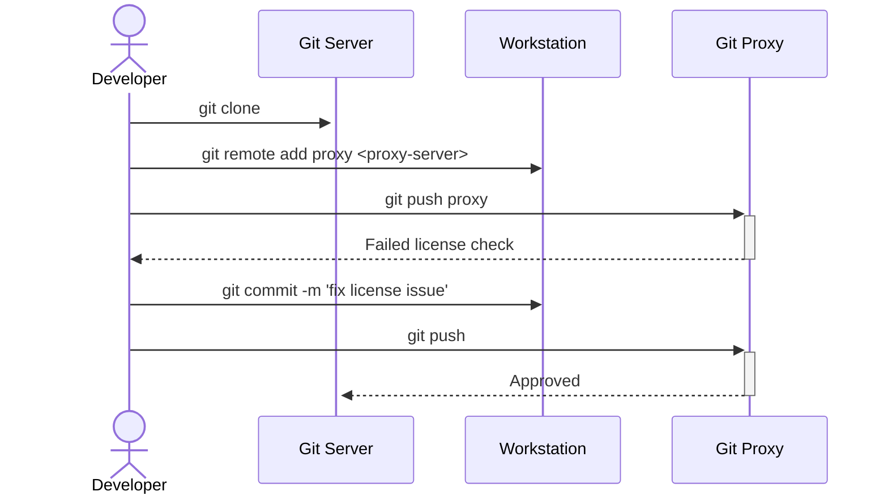

<br />
<div align="center">
  <a href="https://github.com/finos/git-proxy">
    
  </a>

  <br />
  <br />

  <p align="center">
    Deploy custom push protections and policies<br />on top of Git
    <br />
    <br />
    <br />
    <a href="https://git-proxy.finos.org">Docs</a>
    ·
    <a href="https://github.com/finos/git-proxy/issues/new?assignees=&labels=&projects=&template=bug_report.md&title=">Report a bug</a>
    ·
    <a href="https://github.com/finos/git-proxy/issues/new?assignees=&labels=&projects=&template=feature_request.md&title=">Suggest a new feature</a>
  </p>

  <br />

[](https://community.finos.org/docs/governance/Software-Projects/stages/incubating)
[](https://www.npmjs.com/package/@finos/git-proxy)
[](https://github.com/finos/git-proxy/actions/workflows/ci.yml)
[](https://codecov.io/gh/finos/git-proxy)
[](https://git-proxy.finos.org)
<br />
[](https://github.com/finos/git-proxy/blob/main/LICENSE)
[](https://github.com/finos/git-proxy/graphs/contributors)
[](https://app.slack.com/client/T01E7QRQH97/C06LXNW0W76)
[](https://github.com/finos/git-proxy/stargazers)
[](https://github.com/finos/git-proxy/forks)
</div>
<br />

## What is Git Proxy

Git Proxy is an application that stands between developers and a Git remote endpoint (e.g., `github.com`). It applies rules and workflows (configurable as `plugins`) to all outgoing `git push` operations to ensure they are compliant.

The main goal of Git Proxy is to marry the defacto standard Open Source developer experience (git-based workflow of branching out, submitting changes and merging back) with security and legal requirements that firms have to comply with, when operating in highly regulated industries like financial services.

That said, Git Proxy can also be used on a local environment to enforce a single developer's best practices, which tends to be the easiest setup to start with and the most comfortable one to build new Git Proxy plugins.



## Getting Started 🚀

Install & run git-proxy (requires [Nodejs](https://nodejs.org/en/download/)):

```bash
$ npx -- @finos/git-proxy
```

Clone a repository, set the remote to the Git Proxy URL and push your changes:

```bash
$ git clone https://github.com/octocat/Hello-World.git && cd Hello-World
# The below command is using the GitHub official CLI to fork the repo that is cloned.
# You can also fork on the GitHub UI. For usage details on the CLI, see https://github.com/cli/cli
$ gh repo fork
✓ Created fork yourGithubUser/Hello-World
...
$ git remote add proxy http://localhost:8000/yourGithubUser/Hello-World.git
$ git push proxy master
```

Using the default configuration, Git Proxy intercepts the push and _blocks_ it. To enable code pushing to your fork via Git Proxy, add your repository URL into the Git Proxy config file (`proxy.config.json`). For more information, refer to [our documentation](https://git-proxy.finos.org).

## Documentation
For detailed step-by-step instructions for how to install, deploy & configure Git Proxy and
customize for your environment, see the [project's documentation](https://git-proxy.finos.org/docs/):

- [Quickstart](https://git-proxy.finos.org/docs/category/quickstart/)
- [Installation](https://git-proxy.finos.org/docs/installation)
- [Configuration](https://git-proxy.finos.org/docs/category/configuration)

## Contributing

Your contributions are at the core of making this a true open source project. Any contributions you make are **greatly appreciated**. See [`CONTRIBUTING.md`](CONTRIBUTING.md) for more information.

## Security

If you identify a security vulnerability in the codebase, please follow the steps in [`SECURITY.md`](https://github.com/finos/git-proxy/security/policy). This includes logic-based vulnerabilities and sensitive information or secrets found in code.

## Code of Conduct

We are committed to making open source an enjoyable and respectful experience for our community. See <a href="https://github.com/finos/git-proxy/blob/main/CODE_OF_CONDUCT.md"><code>CODE_OF_CONDUCT</code></a> for more information.

## License

This project is distributed under the Apache-2.0 license. See <a href="./LICENSE"><code>LICENSE</code></a> for more information.

## Contact

Drop a note, ask a question or just say hello in our [community Slack channel](https://app.slack.com/client/T01E7QRQH97/C06LXNW0W76) 👋

Otherwise, if you have a deeper query or require more support, please [raise an issue](https://github.com/finos/git-proxy/issues). You can also reach out to [help@finos.org](mailto:help@finos.org).
