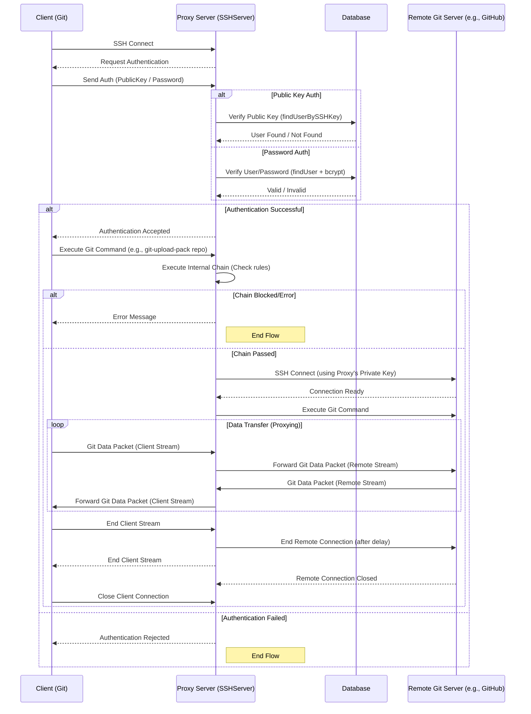

### GitProxy SSH Data Flow

1.  **Client Connection:**
    - An SSH client (e.g., `git` command line) connects to the proxy server's listening port.
    - The `ssh2.Server` instance receives the connection.

2.  **Authentication:**
    - The server requests authentication (`client.on('authentication', ...)`).
    - **Public Key Auth:**
      - Client sends its public key.
      - Proxy formats the key (`keyString = \`${keyType} ${keyData.toString('base64')}\``).
      - Proxy queries the `Database` (`db.findUserBySSHKey(keyString)`).
      - If a user is found, auth succeeds (`ctx.accept()`). The _public_ key info is temporarily stored (`client.userPrivateKey`).
    - **Password Auth:**
      - If _no_ public key was offered, the client sends username/password.
      - Proxy queries the `Database` (`db.findUser(ctx.username)`).
      - If user exists, proxy compares the hash (`bcrypt.compare(ctx.password, user.password)`).
      - If valid, auth succeeds (`ctx.accept()`).
    - **Failure:** If any auth step fails, the connection is rejected (`ctx.reject()`).

3.  **Session Ready & Command Execution:**
    - Client signals readiness (`client.on('ready', ...)`).
    - Client requests a session (`client.on('session', ...)`).
    - Client executes a command (`session.on('exec', ...)`), typically `git-upload-pack` or `git-receive-pack`.
    - Proxy extracts the repository path from the command.

4.  **Internal Processing (Chain):**
    - The proxy constructs a simulated request object (`req`).
    - It calls `chain.executeChain(req)` to apply internal rules/checks.
    - **Blocked/Error:** If the chain returns an error or blocks the action, an error message is sent directly back to the client (`stream.write(...)`, `stream.end()`), and the flow stops.

5.  **Connect to Remote Git Server:**
    - If the chain allows, the proxy initiates a _new_ SSH connection (`remoteGitSsh = new Client()`) to the actual remote Git server (e.g., GitHub), using the URL from `config.getProxyUrl()`.
    - **Key Selection:**
      - It initially intends to use the key from `client.userPrivateKey` (captured during client auth).
      - **Crucially:** Since `client.userPrivateKey` only contains the _public_ key details, the proxy cannot use it to authenticate _outbound_.
      - It **defaults** to using the **proxy's own private host key** (`config.getSSHConfig().hostKey.privateKeyPath`) for the connection to the remote server.
    - **Connection Options:** Sets host, port, username (`git`), timeouts, keepalives, and the selected private key.

6.  **Remote Command Execution & Data Piping:**
    - Once connected to the remote server (`remoteGitSsh.on('ready', ...)`), the proxy executes the _original_ Git command (`remoteGitSsh.exec(command, ...)`).
    - The core proxying begins:
      - Data from **Client -> Proxy** (`stream.on('data', ...)`): Forwarded to **Proxy -> Remote** (`remoteStream.write(data)`).
      - Data from **Remote -> Proxy** (`remoteStream.on('data', ...)`): Forwarded to **Proxy -> Client** (`stream.write(data)`).

7.  **Error Handling & Fallback (Remote Connection):**
    - If the initial connection attempt to the remote fails with an authentication error (`remoteGitSsh.on('error', ...)` message includes `All configured authentication methods failed`), _and_ it was attempting to use the (incorrectly identified) client key, it will explicitly **retry** the connection using the **proxy's private key**.
    - This retry logic handles the case where the initial key selection might have been ambiguous, ensuring it falls back to the guaranteed working key (the proxy's own).
    - If the retry also fails, or if the error was different, the error is sent to the client (`stream.write(err.toString())`, `stream.end()`).

8.  **Stream Management & Teardown:**
    - Handles `close`, `end`, `error`, and `exit` events for both client (`stream`) and remote (`remoteStream`) streams.
    - Manages keepalives and timeouts for both connections.
    - When the client finishes sending data (`stream.on('end', ...)`), the proxy closes the connection to the remote server (`remoteGitSsh.end()`) after a brief delay.

### Data Flow Diagram (Sequence)



```

```
