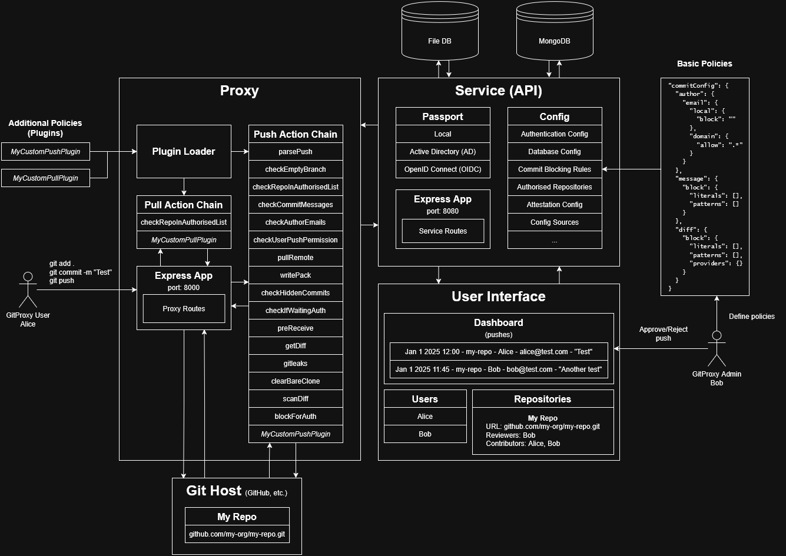

# GitProxy Architecture

This guide explains GitProxy's various components GitProxy, and how they communicate with each other when performing a `git push`.

As mentioned in [the README](/README.md), GitProxy is an application that intercepts pushes and applies rules/policies to ensure they're compliant. Although a number of policies are available by default, these can be extended by using plugins.

## Overview

GitProxy has several main components:

- Proxy (`/src/proxy`): The actual proxy for Git. Git operations performed by users are intercepted here to apply the relevant **chain**. Also loads **plugins** and adds them to the chain. Runs by default on port `8000`.
  - Chain: A set of **processors** that are applied to an action (i.e. a `git push` operation) before requesting review from an approved user
  - Processor: AKA `Step`. A specific step in the chain where certain rules are applied. See the [list of default processors](#processors) below for more details.`
  - Plugin: A custom processor that can be added externally to extend GitProxy's default policies. See the plugin guide for more details.
  <!-- Todo: Add link to plugin guide -->
- Service/API (`/src/service`): Handles UI requests, user authentication to GitProxy (not to Git), database operations and some of the logic for rejection/approval. Runs by default on port `8080`.
  - Passport: The library used to authenticate to the GitProxy API (not the proxy itself - this depends on the Git `user.email`). Supports multiple authentication methods by default (Local, AD, OIDC).
  <!-- Todo: Link to supported methods -->
  - Routes: All the API endpoints used by the UI and proxy to perform operations and fetch or modify GitProxy's state. Except for custom application development, there is no need for users or GitProxy administrators to interact with the API directly.
- Configuration (`/src/config`): Loads and validates the configuration from `proxy.config.json`, or any provided config file. Allows customising several aspects of GitProxy, including databases, authentication methods, predefined allowed repositories, commit blocking rules and more. For a full list of configurable parameters, check the [config file schema reference](https://git-proxy.finos.org/docs/configuration/reference/).
- UI (`/src/ui`): Allows user-friendly interactions with the application. Shows the list of pushes requiring approval, the list of repositories that users can contribute to, and more. Also allows users to easily review the changes in a push, and approve or reject it manually according to company policy.

## Diagram

These are all the core components in the project, along with some basic user interactions:



### Pushing to GitProxy

1. Alice (contributor) sets the GitProxy server as their Git remote
2. Alice commits and pushes something to the proxy
3. The Proxy module intercepts the request, and applies the Push Action Chain to process it
4. The push goes through each step in the chain and either gets rejected, or gets added to the list of pushes pending approval
5. Bob (admin/approver) reviews the push to ensure it complies with policy (Attestation), and approves/rejects it
6. If approved, Alice can push once again to update the actual remote in the Git Host. If rejected, the push will be marked as "rejected", and Alice must update the PR and push again for re-approval

### Approving/Rejecting a push

1. Alice makes a push
2. Bob (approver) logs into his GitProxy account through the UI
3. Bob sees the push on the dashboard, pending review
4. Bob can review the changes made (diff), commit messages and other push info
5. Before approving/rejecting, Bob must review the attestation (list of questions about company policy)
6. Bob can approve the push, allowing Alice to push again (to the actual remote), or reject the push and optionally provide a reason for rejection

### Defining Policies

Three types of policies can be applied to incoming pushes:

- Default policies: These are already present in the GitProxy pull/push chain and require modifying source code to change their behaviour.
  - For example, `checkUserPushPermission` which simply checks if the user's email exists in the GitProxy database, and if their user is marked in the "Contributors" list (`canPush`) for the repository they're trying to push to.
- Configurable policies: These are policies that can be easily configured through the GitProxy config (`proxy.config.json`).
  - For example, `checkCommitMessages` which reads the configuration and matches the string patterns provided with the commit messages in the push in order to block it.
- Custom policies (Plugins): Writing your own Push/Pull plugins provides more flexibility for implementing an organization's rules. For more information, see the guide on writing plugins.
<!-- Todo: add link to plugin guide -->

## The nitty gritty

### Action Chains

Action chains are a list of processors that a Git operation automatically goes through before awaiting approval. Three action chains are currently available:

#### Push action chain

<!-- Todo: Link all the action chains below -->

Executed when a user makes a `git push` to GitProxy. These are the actions in `pushActionChain`, by order of execution:

- `parsePush`
- `checkEmptyBranch`
- `checkRepoInAuthorisedList`
- `checkCommitMessages`
- `checkAuthorEmails`
- `checkUserPushPermission`
- `pullRemote`
- `writePack`
- `checkHiddenCommits`
- `checkIfWaitingAuth`
- `preReceive`
- `getDiff`
- `gitleaks`
- `clearBareClone`
- `scanDiff`
- `blockForAuth`

#### Pull action chain

Executed when a user makes a `git clone` or `git pull` to GitProxy:

- `checkRepoInAuthorisedList`

#### Default action chain

This chain is executed when making any operation other than a `git push` or `git pull`.

- `checkRepoInAuthorisedList`
<!-- Todo: add example and verify this from original PR -->

### Processors

Processors (also known as: push/pull actions) represent operations that each push or pull must go through in order to get approved or rejected.

Processors do not necessarily represent policies. Some processors are just operations that help fetch or process data: For example, `pullRemote` simply clones the remote repository from the Git host.

#### `checkRepoInAuthorisedList`

Checks if the URL of the repo being pushed to is present in the GitProxy repo database. If no repo URL in the database matches, the push is blocked.

Source: [/src/proxy/processors/push-action/checkRepoInAuthorisedList.ts](/src/proxy/processors/push-action/checkRepoInAuthorisedList.ts)

#### `parsePush`

Parses the push request data which comes from the Git client as a buffer that contains packet line data. If anything unexpected happens during parsing, such as malformed pack data or multiple ref updates in a single push, the push will get rejected.

Also handles extraction of push contents, such as commit and committer data.

Source: [/src/proxy/processors/push-action/parsePush.ts](/src/proxy/processors/push-action/parsePush.ts)

#### `checkEmptyBranch`

Checks if the push contains any commit data, or is just an empty branch push (pushing a new branch without any additional commits). Empty branch pushes are blocked because subsequent processors require commit data to work correctly.

Source: [/src/proxy/processors/push-action/checkEmptyBranch.ts](/src/proxy/processors/push-action/checkEmptyBranch.ts)

#### `checkCommitMessages`

A **configurable** processor that blocks pushes containing commit messages that match the provided literals or patterns. These patterns can be configured in `proxy.config.json` or the active configuration file:

```json
"commitConfig": {
  "author": {
    "email": {
      "local": {
        "block": ""
      },
      "domain": {
        "allow": ".*"
      }
    }
  },
  // Defines patterns/literals to block pushes based on their commit messages
  "message": {
    "block": {
      "literals": [],
      "patterns": []
    }
  },
  "diff": {
    "block": {
      "literals": [],
      "patterns": [],
      "providers": {}
    }
  }
},
```

If the arrays are empty, the checks will pass and chain execution will continue.

Note that invalid regex patterns will also fail the `isMessageAllowed` check.

<!-- Todo: verify if this is the case and make an issue to improve error handling for this specifically. Also, the getCommitConfig is being called over and over for each commit message and can be optimized to fetch only once -->

Source: [/src/proxy/processors/push-action/checkCommitMessages.ts](/src/proxy/processors/push-action/checkCommitMessages.ts)

#### `checkAuthorEmails`

Similar to `checkCommitMessages`, allows configuring allowed domains or blocked "locals" (the part before "@domain.com"). If any commit(s) author email(s) match the `local.block` regex, the push gets blocked. Likewise, if any of the emails' domains does not match the `domain.allow` regex, the push gets blocked.

If neither of these are configured (set to empty strings), then the checks will pass and chain execution will continue.

<!-- Todo: Check error handling for invalid regex -->

Source: [/src/proxy/processors/push-action/checkAuthorEmails.ts](/src/proxy/processors/push-action/checkAuthorEmails.ts)

#### `checkUserPushPermission`

Checks if the push has an valid user email associated to it, and if that user is allowed to push to that specific repo.

This step will fail on various scenarios such as:

- Push has no email associated to it (potentially a push parsing error)
- The email associated to the push matches multiple GitProxy users
- The user with the given email isn't in the repo's contributor list (`canPush`)

Source: [/src/proxy/processors/push-action/checkUserPushPermission.ts](/src/proxy/processors/push-action/checkUserPushPermission.ts)

#### `pullRemote`

Clones the repository and temporarily stores it locally. For private repos, it obtains the authorization headers and uses them to authenticate the `git clone` operation.

For security reasons, the cloned repository is deleted later in `clearBareClone`.

Source: [/src/proxy/processors/push-action/pullRemote.ts](/src/proxy/processors/push-action/pullRemote.ts)

#### `writePack`

Executes `git receive-pack` with the incoming pack data from the request body in order to receive the pushed data. It also identifies new `.idx` files in `.git/objects/pack` for other processors (such as `checkHiddenCommits`) to scan more efficiently.

Note that `writePack` sets Git's `receive.unpackLimit` to `0`, which forces Git to always create pack files instead of unpacking objects individually.

Source: [/src/proxy/processors/push-action/writePack.ts](/src/proxy/processors/push-action/writePack.ts)

#### `checkHiddenCommits`

Detects "hidden" commits in a push, which is possible if the pack file in the push was tampered in some way.

It calls `git verify-pack` on each of the new `.idx` files found in `writePack`. If any unreferenced commits are present, the push is blocked.

Source: [/src/proxy/processors/push-action/checkHiddenCommits.ts](/src/proxy/processors/push-action/checkHiddenCommits.ts)

#### `checkIfWaitingAuth`

Checks if the action has been authorised (approved by a reviewer). If so, allows the push to continue to the remote. It simply continues chain execution if the push hasn't been approved.

Source: [/src/proxy/processors/push-action/checkIfWaitingAuth.ts](/src/proxy/processors/push-action/checkIfWaitingAuth.ts)

#### `preReceive`

Allows executing pre-receive hooks from `.sh` scripts located in the `./hooks` directory. **Also allows bypassing the manual approval process.** This enables admins to reuse GitHub enterprise commit policies and provide a seamless experience for contributors who no longer need to wait for approval or be aware of GitProxy intercepting their pushes.

Pre-receive hooks are a feature that allows blocking unwanted commits based on rules described in `.sh` scripts. GitHub provides a set of [sample rules](https://github.com/github/platform-samples/blob/master/pre-receive-hooks) to get started.

This processor will block the push depending on the exit status of the pre-receive hook:

- Exit status `0`: Sets the push to `autoApproved`, skipping the requirement for subsequent approval. Note that this doesn't affect the other processors, which may still block the push.
<!-- Todo: confirm whether pushes that passed the prereceive can still be blocked -->
- Exit status `1`: Sets the push to `autoRejected`, automatically rejecting the push regardless of whether the other processors succeed.
- Exit status `2`: Requires subsequent approval as any regular push.

Source: [/src/proxy/processors/push-action/preReceive.ts](/src/proxy/processors/push-action/preReceive.ts)

#### `getDiff`

Executes `git diff` to obtain the diff for the given revision range. If the commit data is empty or has no entries (possible due to a malformed push), the push is blocked.

The data extracted in this step is later used in `scanDiff`.

Source: [/src/proxy/processors/push-action/getDiff.ts](/src/proxy/processors/push-action/getDiff.ts)

#### `gitleaks`

Runs [Gitleaks](https://github.com/gitleaks/gitleaks) to detect sensitive information such as API keys and passwords in the commits being pushed to prevent credentials from leaking.

The following parameters can be configured:

- `enabled`: Whether scanning is active. `false` by default
- `ignoreGitleaksAllow`: Forces scanning even if developers added `gitleaks:allow` comments
- `noColor`: Controls color output formatting
- `configPath`: Sets a custom Gitleaks rules file

This processor runs the Gitleaks check starting from the root commit to the `commitFrom` value present in the push. If the Gitleaks check fails (nonzero exit code), or otherwise cannot spawn, the push will be blocked.

Source: [/src/proxy/processors/push-action/gitleaks.ts](/src/proxy/processors/push-action/gitleaks.ts)

#### `clearBareClone`

Recursively removes the contents of `./.remote`, which is the location where the bare repository is cloned in `pullRemote`. This exists to prevent tampering with Git data.

<!-- Todo: improve the explanation of why clearBareClone is needed -->

Source: [/src/proxy/processors/push-action/clearBareClone.ts](/src/proxy/processors/push-action/clearBareClone.ts)

#### `scanDiff`

A **configurable** processor that blocks pushes containing diff (changes) that match the provided literals or patterns. These patterns can be configured in `proxy.config.json` or the active configuration file:

```json
"commitConfig": {
  "author": {
    "email": {
      "local": {
        "block": ""
      },
      "domain": {
        "allow": ".*"
      }
    }
  },
  "message": {
    "block": {
      "literals": [],
      "patterns": []
    }
  },
  // Defines patterns/literals to block pushes based on their diff
  "diff": {
    "block": {
      "literals": [],
      "patterns": [],
      "providers": {}
    }
  }
},
```

This will scan every file changed and try to match the configured literals, patterns or providers. If any diff violations are found, the push is blocked.

Source: [/src/proxy/processors/push-action/scanDiff.ts](/src/proxy/processors/push-action/scanDiff.ts)

#### `blockForAuth`

This action appends a message to be displayed after all the processors have finished on a pre-approval push.

Note that this message will show again even if the push had been previously rejected by a reviewer. After a manual rejection, pushing again creates a new `action` object so that the push can be re-reviewed and approved.

<!-- Todo: Add image displaying successful chain execution -->

Source: [/src/proxy/processors/push-action/blockForAuth.ts](/src/proxy/processors/push-action/blockForAuth.ts)

### Authentication

Currently, three different authentication methods are provided for interacting with the UI and adding users. This can be configured by editing the `authentication` array in `proxy.config.json`.

#### Local

Default username/password auth method. Note that this authentication method does not allow adding users directly from the UI (`/api/auth/create-user` must be used instead).

Default accounts are provided for testing:

- Admin: Username: `admin`, Password: `admin`
- User: Username: `user`, Password: `user`

#### ActiveDirectory

Allows AD authentication and user management. The following parameters must be configured in `proxy.config.json`, and `enabled` must be set to `true`:

```json
{
  "type": "ActiveDirectory",
  "enabled": false,
  "adminGroup": "",
  "userGroup": "",
  "domain": "",
  "adConfig": {
    "url": "",
    "baseDN": "",
    "searchBase": "",
    "username": "",
    "password": ""
  }
}
```

#### OpenID Connect

Allows authenticating to OIDC. The following parameters must be configured in `proxy.config.json`, and `enabled` must be set to `true`:

```json
{
  "type": "openidconnect",
  "enabled": false,
  "oidcConfig": {
    "issuer": "",
    "clientID": "",
    "clientSecret": "",
    "callbackURL": "",
    "scope": ""
  }
}
```

When logging in for the first time, this will create a GitProxy user with the email associated to the OIDC, the user will be set to the local portion of the email.

For example: logging in with myusername@mymail.com will create a new user with username set to `myusername`.

#### Adding new methods

New methods can be added by:

1. Extending `/src/service/passport` with the relevant [passport.js strategy](https://www.passportjs.org/packages/).
   - The strategy file must have a `configure` method and a `type` string to match with the config method. See the pre-existing methods in [`/src/service/passport`](/src/service/passport) for more details.
2. Creating a `proxy.config.json` entry with the required configuration parameters
3. Importing the new strategy and adding it to the `authStrategies` array in `/src/service/passport/index.ts`
