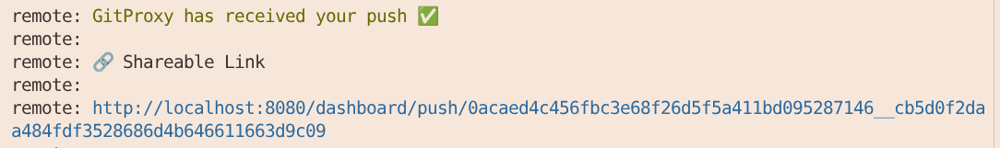

# Processors

**Processors** (also known as push/pull actions) represent operations that each push or pull must go through in order to get approved or rejected.

Processors do not necessarily represent policies. Some processors are just operations that help fetch or process data: For example, [`pullRemote`](#pullremote) simply clones the remote repository from the Git host.

## `parseAction`

A pre-processor that classifies the request into a pull, a push or "default" if it fails to match these. This allows GitProxy to run the correct chain (`pushActionChain`, `pullActionChain` or `defaultActionChain`). Then, it creates an Action object which is used by the selected chain.

This action also handles fallbacks for v1 legacy proxy URLs.

## `checkRepoInAuthorisedList`

Checks if the URL of the repo being pushed to is present in the GitProxy repo database. If no repo URL in the database matches, the push is blocked.

Source: [/src/proxy/processors/push-action/checkRepoInAuthorisedList.ts](/src/proxy/processors/push-action/checkRepoInAuthorisedList.ts)

## `parsePush`

Parses the push request data which comes from the Git client as a buffer that contains packet line data. If anything unexpected happens during parsing, such as malformed pack data or multiple ref updates in a single push, the push will get rejected.

Also handles extraction of push contents, such as the details of the individual commits contained in the push and the details of `committer` (the user attempting to push the commits through the proxy).

Source: [/src/proxy/processors/push-action/parsePush.ts](/src/proxy/processors/push-action/parsePush.ts)

## `checkEmptyBranch`

Checks if the push contains any commit data, or is just an empty branch push (pushing a new branch without any additional commits). Empty branch pushes are blocked because subsequent processors require commit data to work correctly.

Source: [/src/proxy/processors/push-action/checkEmptyBranch.ts](/src/proxy/processors/push-action/checkEmptyBranch.ts)

## `checkCommitMessages`

A **configurable** processor that blocks pushes containing commit messages that match the provided literals or patterns. These patterns can be configured in the `commitConfig.message` entry in `proxy.config.json` or the active configuration file:

```json
"commitConfig": {
  "author": {
    "email": {
      "local": {
        "block": ""
      },
      "domain": {
        "allow": ".*"
      }
    }
  },
  "message": {
    "block": {
      "literals": [],
      "patterns": []
    }
  },
  "diff": {
    "block": {
      "literals": [],
      "patterns": [],
      "providers": {}
    }
  }
},
```

If the arrays are empty, the checks will pass and chain execution will continue.

Note that invalid regex patterns will throw an error during proxy startup. These must be fixed in order to initialize GitProxy.

Source: [/src/proxy/processors/push-action/checkCommitMessages.ts](/src/proxy/processors/push-action/checkCommitMessages.ts)

## `checkAuthorEmails`

Similar to [`checkCommitMessages`](#checkcommitmessages), allows configuring allowed domains or blocked "locals" (the part before "@domain.com"). If any commit(s) author email(s) match the `local.block` regex, the push gets blocked. Likewise, if any of the emails' domains does not match the `domain.allow` regex, the push gets blocked.

If neither of these are configured (set to empty strings), then the checks will pass and chain execution will continue.

Note that invalid regex patterns will throw an error during proxy startup. These must be fixed in order to initialize GitProxy.

Source: [/src/proxy/processors/push-action/checkAuthorEmails.ts](/src/proxy/processors/push-action/checkAuthorEmails.ts)

#### `checkUserPushPermission`

Checks if the push has a valid user email associated to it (the email of the user making the push, **not the individual commit authors**), and if that user is allowed to push to that specific repo.

This step will fail on various scenarios such as:

- Push has no email associated to it (potentially a push parsing error)
- The email associated to the push matches multiple GitProxy users
- The user with the given email isn't in the repo's contributor list (`canPush`)

Note: The _pusher_ can potentially be a different user from the _commit author(s)_. In order to filter the commit authors, you must use the `commitConfig.author` config entry. See [`checkAuthorEmails`](#checkauthoremails) for more details.

Source: [/src/proxy/processors/push-action/checkUserPushPermission.ts](/src/proxy/processors/push-action/checkUserPushPermission.ts)

## `pullRemote`

Clones the repository and temporarily stores it locally in a subdirectory of the _.remote_ folder in the deployment. Each clone is named using the base and head SHA of the push, ensuring a unique clone for each different push. The path to the subdirectory is set in the action as the `proxyGitPath` property and is used in subsequent steps.

For private repos, `pullRemote` uses the authorization headers from the push and uses them to authenticate the `git clone` operation.

In the event that the clone fails, pullRemote will automatically delete the _.remote/\*_ directory that it created - unless that failure was caused by a concurrent request for the same push (so that the earlier request can complete if it is going to).

If the clone succeeds then the chain will schedule deletion of the clone by [`clearBareClone`](#clearbareclone) after processing of the chain completes. This ensures that disk space used is recovered, subsequent pushes of the same SHA don't conflict and that user credentials cached in the `git clone` are removed.

Source: [/src/proxy/processors/push-action/pullRemote.ts](/src/proxy/processors/push-action/pullRemote.ts)

## `writePack`

Executes `git receive-pack` with the incoming pack data from the request body in order to receive the pushed data. It also identifies new `.idx` files in `.git/objects/pack` for other processors (such as [`checkHiddenCommits`](#checkhiddencommits)) to scan more efficiently.

Note that `writePack` sets Git's `receive.unpackLimit` to `0`, which forces Git to always create pack files instead of unpacking objects individually.

Source: [/src/proxy/processors/push-action/writePack.ts](/src/proxy/processors/push-action/writePack.ts)

## `checkHiddenCommits`

Detects "hidden" commits in a push, which is possible if the pack file in the push was tampered in some way.

It calls `git verify-pack` on each of the new `.idx` files found in [`writePack`](#writepack). If any unreferenced commits are present, the push is blocked.

Source: [/src/proxy/processors/push-action/checkHiddenCommits.ts](/src/proxy/processors/push-action/checkHiddenCommits.ts)

## `checkIfWaitingAuth`

Checks if the action has been authorised (approved by a reviewer). If so, allows the push to continue to the remote. It simply continues chain execution if the push hasn't been approved.

Source: [/src/proxy/processors/push-action/checkIfWaitingAuth.ts](/src/proxy/processors/push-action/checkIfWaitingAuth.ts)

## `preReceive`

Allows executing pre-receive hooks from `.sh` scripts located in the `./hooks` directory. **Also allows automating the approval process.** This enables admins to reuse GitHub enterprise commit policies and provide a seamless experience for contributors who no longer need to wait for manual approval or be aware of GitProxy intercepting their pushes.

Pre-receive hooks are a feature that allows blocking or automatically approving commits based on rules described in `.sh` scripts. GitHub provides a set of [sample rules](https://github.com/github/platform-samples/blob/master/pre-receive-hooks) to get started.

**Important**: The pre-receive hook does not bypass the other processors in the chain. All processors continue to execute normally, and any of them can still block the push. The pre-receive hook only determines whether the push will be auto-approved, auto-rejected, or require manual review after all processors have completed.

This processor will block the push depending on the exit status of the pre-receive hook:

- Exit status `0`: Sets the push to `autoApproved`. If no other processors block the push, the contributor can immediately push again to the upstream repository without waiting for manual approval.
- Exit status `1`: Sets the push to `autoRejected`, automatically rejecting the push after the chain completes, regardless of whether the other processors would have allowed it.
- Exit status `2`: Requires subsequent manual approval as any regular push, even if all processors succeed.

For detailed setup instructions and examples, see the [Pre-Receive Hook configuration guide](https://git-proxy.finos.org/docs/configuration/pre-receive/).

Source: [/src/proxy/processors/push-action/preReceive.ts](/src/proxy/processors/push-action/preReceive.ts)

## `getDiff`

Executes `git diff` to obtain the diff for the given revision range. If there are no commits (possibly due to a malformed push), the push is blocked.

The data extracted in this step is later used in [`scanDiff`](#scandiff).

Source: [/src/proxy/processors/push-action/getDiff.ts](/src/proxy/processors/push-action/getDiff.ts)

## `gitleaks`

Runs [Gitleaks](https://github.com/gitleaks/gitleaks) to detect sensitive information such as API keys and passwords in the commits being pushed to prevent credentials from leaking.

The following parameters can be configured:

- `enabled`: Whether scanning is active. `false` by default
- `ignoreGitleaksAllow`: Forces scanning even if developers added `gitleaks:allow` comments
- `noColor`: Controls color output formatting
- `configPath`: Sets a custom Gitleaks rules file

This processor runs the Gitleaks check starting from the root commit to the `commitFrom` value present in the push. If the Gitleaks check fails (nonzero exit code), or otherwise cannot spawn, the push will be blocked.

Source: [/src/proxy/processors/push-action/gitleaks.ts](/src/proxy/processors/push-action/gitleaks.ts)

## `scanDiff`

A **configurable** processor that blocks pushes containing diff (changes) that match the provided literals or patterns. These patterns can be configured in the `commitConfig.diff` entry in `proxy.config.json` or the active configuration file:

```json
"commitConfig": {
  "author": {
    "email": {
      "local": {
        "block": ""
      },
      "domain": {
        "allow": ".*"
      }
    }
  },
  "message": {
    "block": {
      "literals": [],
      "patterns": []
    }
  },
  "diff": {
    "block": {
      "literals": [],
      "patterns": [],
      "providers": {}
    }
  }
},
```

This will scan every file changed and try to match the configured literals, patterns or providers. If any diff violations are found, the push is blocked.

Note that invalid regex patterns will throw an error during proxy startup. These must be fixed in order to initialize GitProxy.

Source: [/src/proxy/processors/push-action/scanDiff.ts](/src/proxy/processors/push-action/scanDiff.ts)

## `blockForAuth`

This action appends a message to be displayed after all the processors have finished on a pre-approval push.

Note that this message will show again even if the push had been previously rejected by a reviewer or cancelled and resubmitted by the committer. After a manual rejection, pushing again creates a new `action` object so that the push can be re-reviewed and approved.



Source: [/src/proxy/processors/push-action/blockForAuth.ts](/src/proxy/processors/push-action/blockForAuth.ts)

## `audit`

This action runs after a chain has been executed. It stores in the database the entire `Action` object along with the list of `steps` that the action has gone through and their associated logs or error messages that occurred during processing of the chain.

Note: **`audit` writes all actions** (push, pull, default/unclassified) to the DB.

An action object (or entry in the pushes table) might look like this:

```json
{
  "steps": [
    {
      "logs": [
        "checkRepoInAuthorisedList - repo https://github.com/finos/git-proxy.git is in the authorisedList"
      ],
      "id": "73d47899-b1f8-45f0-9fd5-ef2535a07bbd",
      "stepName": "checkRepoInAuthorisedList",
      "content": null,
      "error": false,
      "errorMessage": null,
      "blocked": false,
      "blockedMessage": null
    }
  ],
  "error": false,
  "blocked": false,
  "allowPush": false,
  "authorised": false,
  "canceled": false,
  "rejected": false,
  "autoApproved": false,
  "autoRejected": false,
  "commitData": [],
  "id": "1763522405484",
  "type": "default",
  "method": "GET",
  "timestamp": 1763522405484,
  "url": "https://github.com/finos/git-proxy.git",
  "repo": "https://github.com/finos/git-proxy.git",
  "project": "finos",
  "repoName": "git-proxy.git",
  "lastStep": {
    "logs": [
      "checkRepoInAuthorisedList - repo https://github.com/finos/git-proxy.git is in the authorisedList"
    ],
    "id": "73d47899-b1f8-45f0-9fd5-ef2535a07bbd",
    "stepName": "checkRepoInAuthorisedList",
    "content": null,
    "error": false,
    "errorMessage": null,
    "blocked": false,
    "blockedMessage": null
  },
  "_id": "h69TOxN1AMsxd0xr"
}
```

## `clearBareClone`

Recursively removes the contents of the (modified) repository clone stored in `./.remote` by [`pullRemote`](#pullremote) and indivated by the `proxyGitPath` property of the `Action`. This clean-up is necessary for:

- Security (cached credentials):
  - Since repositories require a git username and password or personal access token (PAT) on clone and these are cached in the clone, they must be removed to prevent leakage.
- Managing disk space:
  - Without deletion, `./.remote` would grow indefinitely as new repository clones are added for each push (rather than each repository!)
  - Each action gets a unique directory for isolation in [`pullRemote`](#pullremote), which allows pushes to the same repository for multiple users to be processed concurrently without conflicts or confusion over credentials.

`clearBareClone` runs only if `pullRemote` was successful.

Source: [/src/proxy/processors/post-processor/clearBareClone.ts](/src/proxy/processors/post-processor/clearBareClone.ts)
