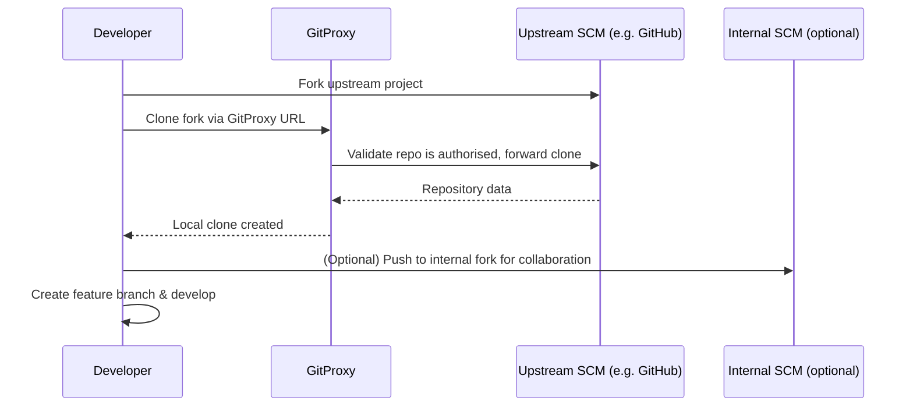
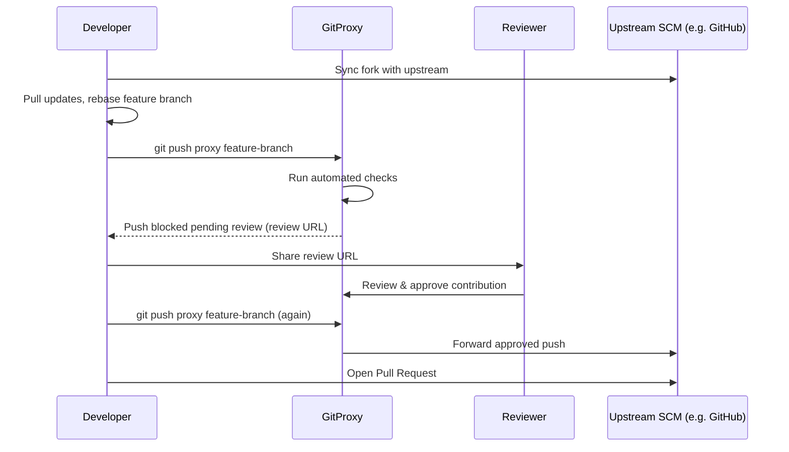

# GitProxy User Manual

## Introduction

GitProxy is a web proxy application that forwards traffic towards external Source Code Management (SCM) platforms, such as GitHub, GitLab, and Bitbucket. It provides administrative control over which projects traffic is forwarded for and implements governance workflows over contributions, in the form of automated scans and manual reviews.

### Quick Start

1. Check your organisation's Open Source policy and satisfy any approval or training requirements necessary before contributing to an Open Source project.
2. [Fork the project you wish to contribute to](#setting-up-a-fork) and notify your OSPO or Open Source leads.
3. Acquire access to your organisation's GitProxy instance (the method depends on your deployment — see [Authentication](#authentication)).
4. Retrieve the proxied git URL for your project from the GitProxy UI and clone it — use a [Personal Access Token (PAT) from GitHub](https://docs.github.com/en/authentication/keeping-your-account-and-data-secure/managing-your-personal-access-tokens) (or whichever upstream SCM you are working with) to authenticate.

### Why use GitProxy?

Organisations in regulated industries must demonstrate to regulators and auditors that they control the risks associated with contributing to external projects:

**Risk management:**

- **Data and IP loss:** Inappropriate contributions of proprietary code to external projects can expose intellectual property.
- **Reputational harm:** Inappropriate contributions can damage an organisation's reputation and relationships with open source communities.
- **Supply chain attacks:** Attacks targeting developer machines can hunt for credentials and automate their exfiltration by contributing them to external SCM platforms using cached developer credentials.

**The solution:**

GitProxy enables contribution to external projects while maintaining security and compliance by:

- Making contributions auditable with full tracking of who contributed what and when
- Providing governance through automated security checks and manual review workflows
- Ensuring all contributions are reviewed before reaching external platforms
- Maintaining a clear audit trail for regulators and auditors

### Supported destinations

GitProxy is designed to work with any git server as a destination, including:

- GitHub (github.com and GitHub Enterprise)
- GitLab (gitlab.com and self-hosted/dedicated instances)
- Bitbucket (Cloud and Server)
- Any other git server accessible via HTTPS or SSH

This broad compatibility is possible because GitProxy operates at the Git protocol level rather than relying on proprietary SCM platform APIs. As long as the destination supports standard git operations over HTTPS or SSH, GitProxy can proxy traffic to it.

GitProxy supports both **HTTPS** and **SSH** protocols. HTTPS uses Personal Access Tokens for authentication, while SSH uses key-based authentication with agent forwarding. See the [SSH Setup Guide](./ssh-setup) for instructions on configuring SSH access.

### How does it work

GitProxy operates as an intercepting proxy that sits between your local git client and external SCM platforms. When you perform git operations, GitProxy intercepts them, applies governance workflows, and forwards approved changes to the destination.

#### Ingress flow



1. You'll usually need to [fork the project](https://docs.github.com/en/pull-requests/collaborating-with-pull-requests/working-with-forks/fork-a-repo) you wish to contribute to (unless you have write permissions to it on its host SCM).
2. GitProxy is configured for the forked project (with nominated contributors and reviewers), allowing you to clone, fetch and pull the project through the proxy. The GitProxy URL is added to your local clone as a _remote_.
3. (Optional) You can create an empty repo in your internal SCM platform and push the project into it to create an internal fork for collaboration with colleagues.
4. Create a feature branch within the project and start developing your contributions.

#### Egress flow



1. Sync your fork with the parent project.
2. Pull any updates from the upstream repo into your local copy of the project's default branch.
3. Update your feature branch from the updated default branch and resolve any conflicts.
4. Push your changes to GitProxy — which will receive them, apply automated scans and then block their egress, providing a URL for review. Pass this to one of the nominated reviewers for the project.
5. Once reviewed, push the changes again. They will automatically egress and be forwarded to your fork of the upstream project.
6. [Raise a Pull Request](https://docs.github.com/en/pull-requests/collaborating-with-pull-requests/proposing-changes-to-your-work-with-pull-requests/creating-a-pull-request) from your fork into the upstream project to contribute them.

:::note
Throughout this guide, we refer to `main` as the default branch. Some projects use `master`, `develop`, or another branch name as their trunk. Check the upstream project's repository to confirm which branch is used and substitute accordingly.
:::

#### Authentication

GitProxy uses two separate authentication mechanisms:

- **Proxy authentication (for git operations):** Over **HTTPS**, you authenticate using a **Personal Access Token (PAT)** from the target SCM platform (e.g., GitHub PAT). GitProxy forwards these credentials when cloning repositories to calculate diffs and when pushing approved changes upstream. For GitHub you'll need a personal access token (classic) with `repo` permissions. See [GitHub's documentation](https://docs.github.com/en/authentication/keeping-your-account-and-data-secure/managing-your-personal-access-tokens#creating-a-personal-access-token-classic) for details. Over **SSH**, authentication uses SSH key-based agent forwarding — see the [SSH Setup Guide](./ssh-setup).
- **UI authentication (for the web interface):** GitProxy supports multiple authentication methods for the web interface, including local accounts, Active Directory/LDAP, and OpenID Connect (OIDC). See the [Authentication configuration](/docs/configuration/authentication) page for details on available options.

:::info Your organisation's configuration
The specific authentication method used for the GitProxy web interface depends on how your organisation has deployed GitProxy. Contact your OSPO or Open Source leads for the correct login credentials and method.
:::

#### Checks applied to contributions

GitProxy applies a series of automated checks (called [Processors](architecture/processors.md)) to every push. These checks run in sequence, and if any check fails, the push is blocked. The main checks include:

**Repository and permission checks:**

- **Authorized repository check:** Verifies the repository is in GitProxy's approved list.
- **User permission check:** Confirms the pusher has contributor access to the repository.
- **Empty branch check:** Blocks pushes that create branches without commits.

**Commit validation:**

- **Commit message scanning:** Blocks commits with messages containing configured forbidden patterns (e.g., "password", "secret", AWS keys).
- **Author email validation:** Ensures commit author emails match allowed domains and don't use blocked addresses (e.g., noreply@).
- **Hidden commit detection:** Identifies tampered pack files containing unreferenced commits.

**Content security scanning:**

- **Gitleaks scanning:** Detects secrets, API keys, passwords, and credentials in code changes.
- **Diff scanning:** Blocks changes containing configured sensitive patterns (e.g., private keys, database connection strings, debug flags).
- **Pre-receive hooks:** Optional custom scripts that can auto-approve, auto-reject, or require manual review based on organization-specific rules.

After all automated checks pass, the contribution enters a pending state where an authorized reviewer must manually approve it before it can be pushed to the upstream repository. All actions are audited and stored in the database for compliance purposes.

:::info Extending checks with plugins
Organisations can extend the default checks by writing custom [plugins](/docs/development/plugins). The checks applied to your contributions may differ from those listed above depending on your organisation's GitProxy configuration.
:::

:::warning No email notifications
GitProxy does not currently send email notifications for pending reviews. You must contact the nominated reviewers directly and share the review link with them.
:::

## Adding a project to GitProxy

### Prerequisites

Before a project can be added to GitProxy, check your organisation's Open Source policy and satisfy its requirements. This typically involves:

1. **Review your Open Source Policy** — familiarise yourself with your organisation's contribution policy.
2. **Submit an application** — follow your organisation's process for requesting approval to contribute to an external project.
3. **Obtain approval** — your OSPO or Open Source leads will review your application and arrange any further sign-off required.

### Setting up a fork

In most cases you will not have write access to the upstream repository you wish to contribute to. You will need to [create a fork](https://docs.github.com/en/pull-requests/collaborating-with-pull-requests/working-with-forks/fork-a-repo) — a copy of the repository that you own — and have that fork added to GitProxy instead. Contributions are then made by pushing to your fork through GitProxy and opening a [Pull Request](https://docs.github.com/en/pull-requests/collaborating-with-pull-requests/proposing-changes-to-your-work-with-pull-requests/creating-a-pull-request) from your fork into the upstream project.

- If you are the sole contributor from your organisation, you can [create a personal fork](https://docs.github.com/en/pull-requests/collaborating-with-pull-requests/working-with-forks/fork-a-repo) on the target SCM platform and have it added to GitProxy.
- If multiple engineers will contribute to the same project, you can create an [internal fork](#do-you-need-to-collaborate-internally-creating-an-internal-fork) of the project in your internal SCM platform and collaborate on contributions there. One or two contributors can then push changes to the upstream project through GitProxy via their personal forks. Commits are individually attributed, so the person pushing will not appear to have done all the work — they merely delivered it to the upstream project.
  - Alternatively, your OSPO or Open Source leads can create a shared fork on the target SCM platform owned by your organisation. This avoids routing contributions through personal forks and may be preferable for projects with many contributors.

Forks should generally have the same name as the upstream project to avoid confusion.

:::tip Keeping your fork up to date
It is your responsibility to keep your external fork synced with the upstream repository. An out-of-date fork will lead to merge conflicts when you open a Pull Request. Most SCM platforms make this straightforward — for example, GitHub provides a "Sync fork" button on your fork's page that updates your default branch with a single click. You should sync your fork before starting new work and again before pushing a contribution through GitProxy.
:::

### Requesting the project be added

Once your contribution has been approved, contact your OSPO or Open Source leads to request that the project (or your fork of it) be added to GitProxy. Provide:

- The full repository URL to be added (your fork or the upstream project if you have write access)
- The names of contributors and reviewers to be authorised

## Adding a user in GitProxy to contribute or review

Contributors and reviewers must be explicitly added to a repository in GitProxy before they can push to it or review contributions.

### Prerequisites

Before being added as a contributor or reviewer, satisfy the requirements of your organisation's Open Source policy. For example, you may be expected to complete training such as the free [Open Source Contribution in Finance (LFD137)](https://training.linuxfoundation.org/training/open-source-contribution-in-finance-lfd137/) course from Linux Foundation Training.

### Steps

1. Acquire access to your organisation's GitProxy instance (the method depends on your deployment).
2. Log in to the GitProxy web interface to create your user account. The authentication method depends on your organisation's configuration — see [Authentication](#authentication).

Contact your OSPO or Open Source leads to be added as a contributor or reviewer on the relevant repository.

## Contributing to a project through GitProxy

### Do you have write access? Creating a fork

If you do not have write access to the upstream repository, you will need a fork. See [Setting up a fork](#setting-up-a-fork) for guidance on choosing between a personal fork, an internal fork for collaboration, or a shared fork.

Once your fork exists and has been added to GitProxy, add it as a remote:

```bash
git remote add proxy http://<your-gitproxy-host>:<port>/<organization-or-username>/<repository>.git
```

Push your changes through GitProxy to your fork, then [open a Pull Request](https://docs.github.com/en/pull-requests/collaborating-with-pull-requests/proposing-changes-to-your-work-with-pull-requests/creating-a-pull-request) from your fork into the upstream project.

### Do you need to collaborate internally? Creating an internal fork

An internal fork on your internal SCM platform allows you to collaborate with colleagues on contributions before pushing them externally through GitProxy. This is useful for:

- Running internal CI/CD pipelines against your changes
- Reviewing contributions internally via Merge Requests before external submission
- Coordinating work across multiple contributors

**Working with the internal fork:**

- Retain an unmodified copy of the upstream project's default branch (typically `main`) as a base for your contributions. Do not commit internal changes — such as pipeline configurations — directly to it. Instead, keep the default branch clean and synced with upstream, and use a separate internal branch (e.g., `internal` or `ci`) for pipeline configs and other organisation-specific changes.
- Create feature branches off the default branch for your contributions.
- When ready to contribute, [push your feature branch through GitProxy](#pushing-to-the-remote-repository-through-gitproxy) to your external fork, then open a Pull Request into the upstream project.

:::note
Avoid pushing internal pipeline configurations or organisation-specific files to the upstream project — particularly if it is hosted on a different platform.
:::

### Pushing to the remote repository through GitProxy

#### Git client configuration

Before using GitProxy, ensure your git client is properly configured.

**Set your git identity:**

```bash
git config --global user.name "Your Name"
git config --global user.email "your.email@example.com"
```

Your email must match the email registered in GitProxy.

##### SSL certificate configuration

:::tip Internal Certificate Authorities
If your organisation uses internal Certificate Authorities (CAs) for SSL certificates on internal infrastructure, tools like git may not recognise these CAs by default, causing certificate errors. If you encounter SSL errors, the advice in this section may help to resolve them.
:::

If your organisation uses an internal Certificate Authority (CA) to issue the SSL certificates for you Git proxy server, your git client may need to be configured to use your operating system's certificate store.

On a Windows machine, set the SSL backend to use the Windows system certificate store:

```bash
git config --global http.sslBackend schannel
```

On Linux, the `schannel` backend is not available. Instead, point git at a certificate bundle that includes your organisation's internal CA certificates:

```bash
git config --global http.sslCAInfo /path/to/ca-certificates.crt
```

The exact path depends on your distribution (e.g., `/etc/ssl/certs/ca-certificates.crt` on Ubuntu). Your organisation's internal CA certificates must be added to this bundle for git to trust internal infrastructure. Refer to your organisation's developer onboarding documentation for instructions on updating certificates in your environment.

In both cases, ensure SSL verification is not disabled:

```bash
git config --global --get http.sslVerify
```

If the command returns `false`, unset it:

```bash
git config --global --unset http.sslVerify
```

#### Authentication and Personal Access Tokens

When performing git operations through GitProxy (cloning, fetching, pushing), you must authenticate with credentials from the target SCM platform (e.g., GitHub). This is because GitProxy forwards your credentials to the upstream platform on your behalf.

SCMs will typically require:

- Your username on the target platform (e.g., your GitHub username)
- A Personal Access Token (PAT) from the target platform, **not** your password.

**Creating a Personal Access Token (GitHub):**

1. Go to GitHub Settings → Developer Settings → Personal Access Tokens → Tokens (classic)
2. Click "Generate new token (classic)"
3. Give it a descriptive name (e.g., "GitProxy")
4. Select the `repo` scope (full control of private repositories)
5. Set an appropriate expiration date
6. Click "Generate token" and copy it immediately (you won't see it again)

:::warning PAT security

- Your PAT must have the `repo` permission scope.
- Keep your PAT secure and never commit it to a repository.
- If your PAT expires, you'll need to generate a new one.
- If you are prompted for credentials every time, check that your credential helper is configured.
  :::

This is separate from the credentials you use to log in to the GitProxy web interface for reviewing contributions and managing repositories.

#### Cloning the project through GitProxy

You can clone a repository through GitProxy using the proxy URL (also found in the GitProxy web interface under "Repositories"):

```bash
git clone http://<your-gitproxy-host>:<port>/<organization>/<repository>.git
```

When prompted, enter your target platform credentials (see [Authentication and Personal Access Tokens](#authentication-and-personal-access-tokens) above).

If you clone through GitProxy, `origin` will point to the GitProxy URL and you can push directly to `origin`. However, in many cases you will have cloned from elsewhere — the upstream platform, your personal fork, or an internal fork. In those cases, you need to add GitProxy as an additional remote.

#### Adding a remote to an existing clone

If you cloned from the upstream platform, your personal fork, or an internal fork, your `origin` remote will point to that source. Add GitProxy as a separate remote:

```bash
cd /path/to/your/repository
git remote add proxy http://<your-gitproxy-host>:<port>/<organization>/<repository>.git
```

Verify the remote was added:

```bash
git remote -v
```

You should now see both `origin` and `proxy`.

#### Pushing through the proxy

Once GitProxy is configured as a remote, push your changes to it:

```bash
git push proxy <branch-name>
```

Or to push your current branch:

```bash
git push proxy HEAD
```

**What happens next:**

1. GitProxy intercepts your push and runs automated checks
2. If checks pass, you'll see a message indicating the push is awaiting approval
3. If checks fail, you'll see an error message explaining what needs to be fixed
4. Once a reviewer approves your contribution, push again to send changes upstream

#### Request a review

After pushing to GitProxy and passing all automated checks, your contribution enters a pending state awaiting manual review.

**Finding the review link:**

When your push passes all automated scans, GitProxy will output a URL for the review directly in your terminal as part of the git push response. Copy this link to share with a reviewer.

Alternatively, find the review link through the GitProxy web interface:

1. Log in to the GitProxy UI
2. Navigate to the "Pushes" or "Dashboard" tab
3. Find your pending contribution in the list

**Notifying a reviewer:**

GitProxy does not currently send email notifications for pending reviews. You will need to notify a reviewer directly — share the review link with them via your team's preferred channel. Reviewers for each project are listed in the project configuration in the GitProxy UI.

**After review:**

- If approved: Push again to send your changes to the upstream repository
- If rejected: Review the feedback, make necessary changes, commit them, and push again to create a new review request

#### When approved, push again

Once your contribution has been approved by a reviewer:

1. Push the same branch again to GitProxy:

   ```bash
   git push proxy <branch-name>
   ```

2. GitProxy will recognize the approved push and forward it to the upstream repository
3. Your changes are now in the upstream repository and visible to the project maintainers

:::warning

- You must push the exact same commits that were approved.
- If you make new commits after approval, they will require a new review.
- The approval is specific to the commit SHA(s) that were reviewed.
- After successful push to upstream, you can create a pull request on the target platform as normal.
  :::

### Reviewing contributions

If you have reviewer permissions for a project in GitProxy, you can approve or reject contributions from other users.

**Review process:**

1. **Log in to GitProxy:** Navigate to your GitProxy web interface and authenticate
2. **View pending contributions:** Go to the "Pushes" or "Dashboard" tab to see contributions awaiting review
3. **Examine the contribution:** Click on a pending push to view:
   - Full diff of all changes
   - Commit messages and author information
   - Results of automated security and quality checks
   - Repository and branch information
4. **Complete the attestation:** Before approving, you must confirm the contribution complies with policies and is appropriate for the target repository
5. **Make a decision:**
   - **Approve:** Click "Approve". The contributor can then push again to send changes upstream.
   - **Reject:** Click "Reject" and provide clear feedback explaining what needs to be fixed.

**Reviewer responsibilities:**

- Ensure contributions don't contain sensitive organisational information or intellectual property
- Verify changes align with the target project's contribution guidelines
- Check that code quality meets acceptable standards
- Confirm no credentials, secrets, or PII are being exposed
- Provide constructive feedback when rejecting contributions

### Troubleshooting

**Git keeps asking for my credentials**

If you're prompted for credentials on every git operation, the Git Credential Manager (GCM) may be disabled or misconfigured.

:::info
Credentials request popups will vary based on your git client. VS code (and derivates) may catch the credentials request and display their own UI, while Git Bash will display Git Credentials Manager popups.
:::

Verify if your GCM configuration has been altered:

```bash
git config --global --get credential.helper
```

If this returns anything, unset it so Git uses the system-level GCM:

```bash
git config --global --unset credential.helper
```

Verify Git is now using the system-level GCM:

```bash
git config --show-origin --get-all credential.helper
```

**The proxy is not accepting my credentials**

Make sure that:

- You are using the username for the SCM you're pushing through the proxy to (e.g., your GitHub username)
- You are using a Personal Access Token (PAT), not your password
- Your PAT is not expired
- Your PAT has the `repo` permissions scope enabled
- You have copied and pasted the PAT correctly

**My push was blocked because a commit author is not a registered contributor**

GitProxy checks that every commit in a push is authored by a user registered as a contributor on the repository. To resolve:

1. **Add the author as a contributor** in GitProxy — contact your OSPO or Open Source leads.
2. **Remove the offending commit** from your branch using an interactive rebase:

   ```bash
   git rebase -i HEAD~<number-of-commits>
   ```

**My push was blocked with a commit message error**

Your commit messages contain forbidden patterns. To fix:

1. Review the error message to identify which pattern was matched
2. Amend your commit messages:

   ```bash
   git rebase -i HEAD~<number-of-commits>
   ```

3. Mark commits to edit, change the messages, and continue the rebase
4. Push again to GitProxy

**My push was blocked by Gitleaks or diff scanning**

Your code changes contain secrets, credentials, or sensitive patterns. To fix:

1. Review the error message to identify what was detected
2. Remove the sensitive content from your code
3. If you accidentally committed secrets:
   - Remove them from the code
   - Rotate/revoke the exposed credentials immediately
   - Use git rebase to remove them from history if needed
4. Commit the fixes and push again

**My push was blocked because the repository is not authorized**

The repository you're trying to push to is not in GitProxy's approved list. Contact your OSPO or Open Source leads to request the repository be added, providing the full repository URL and justification for access.

**I can't log in to the GitProxy UI**

Make sure that:

- You have the required access to the GitProxy instance
- You are using the correct credentials for your organisation's authentication method (see [Authentication](#authentication))
- You are accessing the correct URL for your GitProxy deployment

:::info
The login method depends on your organisation's GitProxy configuration. It may use local accounts, Active Directory, or OIDC. Contact your OSPO or Open Source leads if you are unsure.
:::

**My approved push is not going through**

Ensure that:

- You are pushing the exact same commits that were approved (same SHA)
- You haven't made additional commits since the approval
- Your credentials are still valid and not expired
- The upstream repository still exists and you have access to it

**I'm getting SSL/TLS certificate errors**

If you encounter certificate validation errors:

1. Ensure you're using the correct GitProxy URL
2. Ensure that your SSL configuration is not `http.sslVerify=false`
3. Check that your system's certificate store is up to date
4. Contact your OSPO or Open Source leads if the issue persists

**Encountering other git operation issues**

If you encounter any other issues, gather the following diagnostic information:

```bash
cd /path/to/your/repository
git remote -v
git config --list --show-origin
GIT_CURL_VERBOSE=1 GCM_TRACE=1 git push proxy <branch-name>
```

:::warning
Ensure there are no passwords in the output before sharing it. Review the output and redact any sensitive information.
:::

**My commits are missing DCO sign-offs**

Many open source projects require contributors to sign off their commits using the [Developer Certificate of Origin (DCO)](https://developercertificate.org). A DCO sign-off is a line at the end of each commit message:

```
Signed-off-by: Your Name <your.email@example.com>
```

Check the project's `CONTRIBUTING.md` to determine whether DCO sign-offs are required. Projects hosted by foundations such as FINOS and the Linux Foundation typically require them.

To sign off commits, add the `-s` flag:

```bash
git commit -s -m "Your commit message"
```

To sign off every commit by default:

```bash
git config --global format.signOff true
```

If you have already made commits without sign-offs, add them retroactively:

```bash
git rebase --signoff HEAD~3
```

Or to fix all commits since diverging from the default branch:

```bash
git rebase --signoff main
```

:::warning
Rebasing changes the SHA hashes of the affected commits. If you have already pushed these commits through GitProxy and they have been approved, the rebased commits will be treated as a new push and will require a new approval. Plan your sign-offs before pushing through GitProxy where possible.
:::
